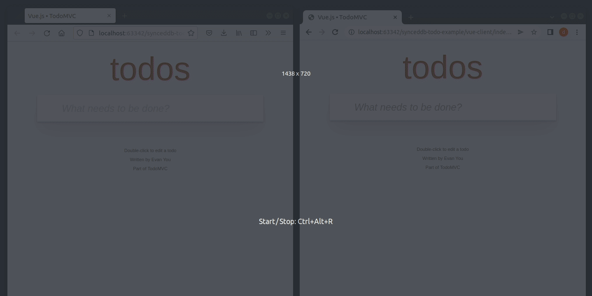

# IndexedDB with usability and remote syncing

This is a fork of the awesome [`idb`](https://github.com/jakearchibald/idb) library, which adds the ability to sync an IndexedDB database with a remote REST API.



The source code for the example above can be found [here](https://github.com/darrachequesne/synceddb-todo-example).

Bundle size: ~3.48 kB brotli'd

Based on [`idb@7.0.2`](https://github.com/jakearchibald/idb/releases/tag/v7.0.2) (Jun 2022): [e04104a...HEAD](https://github.com/darrachequesne/synceddb/compare/e04104a...HEAD)

**Table of content**

<!-- TOC -->
* [Features](#features)
  * [All the usability improvements from the `idb` library](#all-the-usability-improvements-from-the-idb-library)
  * [Sync with a remote REST API](#sync-with-a-remote-rest-api)
  * [Auto-reloading queries](#auto-reloading-queries)
  * [Computed stores](#computed-stores)
* [Disclaimer](#disclaimer)
* [Installation](#installation)
* [API](#api)
  * [SyncManager](#syncmanager)
    * [Options](#options)
      * [`fetchOptions`](#fetchoptions)
      * [`fetchInterval`](#fetchinterval)
      * [`buildPath`](#buildpath)
      * [`buildFetchParams`](#buildfetchparams)
      * [`updatedAtAttribute`](#updatedatattribute)
      * [`withoutKeyPath`](#withoutkeypath)
    * [Methods](#methods)
      * [`start()`](#start)
      * [`stop()`](#stop)
      * [`clear()`](#clear)
      * [`hasLocalChanges()`](#haslocalchanges)
      * [`onfetchsuccess`](#onfetchsuccess)
      * [`onfetcherror`](#onfetcherror)
      * [`onpushsuccess`](#onpushsuccess)
      * [`onpusherror`](#onpusherror)
  * [LiveQuery](#livequery)
    * [Example with React](#example-with-react)
    * [Example with Vue.js](#example-with-vuejs)
  * [`createComputedStore()`](#createcomputedstore)
* [Expectations for the REST API](#expectations-for-the-rest-api)
  * [Fetching changes](#fetching-changes)
  * [Pushing changes](#pushing-changes)
* [Alternatives](#alternatives)
* [Miscellaneous](#miscellaneous)
<!-- TOC -->

## Features

### All the usability improvements from the `idb` library

Since it is a fork of the [`idb`](https://github.com/jakearchibald/idb) library, `synceddb` shares the same Promise-based API:

```js
import { openDB, SyncManager } from 'synceddb';

const db = await openDB('my-awesome-database');

const transaction = db.transaction('items', 'readwrite');
await transaction.store.add({ id: 1, label: 'Dagger' });

// short version
await db.add('items', { id: 1, label: 'Dagger' });
```

Async iterators are supported too (please notice the specific import):

```js
import { openDB, SyncManager } from 'synceddb/with-async-ittr';

const tx = db.transaction('items');

for await (const cursor of tx.store) {
  // ...
}
```

More information [here](https://github.com/jakearchibald/idb#api).

### Sync with a remote REST API

Every change is tracked in a store. The [SyncManager](#syncmanager) then sync these changes with the remote REST API when the connection is available, making it easier to build offline-first applications.

```js
import { openDB, SyncManager } from 'synceddb';

const db = await openDB('my-awesome-database');
const manager = new SyncManager(db, 'https://example.com');

manager.start();

// will result in the following HTTP request: POST /items
await db.add('items', { id: 1, label: 'Dagger' });

// will result in the following HTTP request: DELETE /items/2
await db.delete('items', 2);
```

See also: [Expectations for the REST API](#expectations-for-the-rest-api)

### Auto-reloading queries

The [LiveQuery](#livequery) provides a way to run a query every time the underlying stores are updated:

```js
import { openDB, LiveQuery } from 'synceddb';

const db = await openDB('my awesome database');

let result;

const query = new LiveQuery(['items'], async () => {
  // result will be updated every time the 'items' store is modified
  result = await db.getAll('items');
});

// trigger the liveQuery
await db.put('items', { id: 2, label: 'Long sword' });

// or manually run it
await query.run();
```

Inspired from [Dexie.js liveQuery](https://dexie.org/docs/liveQuery()).


### Computed stores

A computed store is a bit like [a materialized view in PostgreSQL](https://www.postgresql.org/docs/current/rules-materializedviews.html), it is updated every time one of the source object stores is updated:

```js
import { openDB, createComputedStore } from 'synceddb/with-async-ittr';

const db = await openDB('my awesome database');

await createComputedStore(db, 'invoices-with-customer', 'invoices', ['customers'], async (tx, change) => {
  const computedStore = tx.objectStore('invoices-with-customer');

  if (change.storeName === 'invoices') {
    if (change.operation === 'add' || change.operation === 'put') {
      const invoice = change.value;
      // fetch the customer object
      invoice.customer = await tx.objectStore('customers').get(invoice.customerId);
      // update the computed store
      computedStore.put(invoice);
    } else { // change.operation === 'delete'
      computedStore.delete(change.key);
    }
  }

  if (change.storeName === 'customers') {
    if (change.operation === 'put') {
      const customer = change.value;
      // update all invoices with the given customer in the computed store
      for await (const cursor of computedStore.index('by-customer').iterate(change.key)) {
        const invoice = cursor.value;
        if (invoice.customerId === customer.id) {
          invoice.customer = customer;
          cursor.update(invoice);
        }
      }
    }
  }
});
```

This feature is great when you need to:

- apply some filters on an aggregation of multiple object stores (no need to compute the JOIN in memory, and then apply the filters)
- compute statistics over historical data (as the data is computed incrementally)


## Disclaimer

- no version history

Only the last version of each entity is kept on the client side.

- basic conflict management

The last write wins (though you can customize the behavior in the [`onpusherror`](#onpusherror) handler).

## Installation

```sh
npm install synceddb
```

Then:

```js
import { openDB, SyncManager, LiveQuery } from 'synceddb';

async function doDatabaseStuff() {
  const db = await openDB('my awesome database');

  // sync your database with a remote server
  const manager = new SyncManager(db, 'https://example.com');

  manager.start();
  
  // create an auto-reloading query
  let result;
  const query = new LiveQuery(['items'], async () => {
    // result will be updated every time the 'items' store is modified
    result = await db.getAll('items');
  });
}
```

## API

For database-related operations, please see the `idb` [documentation](https://github.com/jakearchibald/idb#api).

### SyncManager

```js
import { openDB, SyncManager } from 'synceddb';

const db = await openDB('my-awesome-database');
const manager = new SyncManager(db, 'https://example.com');

manager.start();
```

#### Options

##### `fetchOptions`

Additional options for all HTTP requests.

```js
import { openDB, SyncManager } from 'synceddb';

const db = await openDB('my-awesome-database');
const manager = new SyncManager(db, 'https://example.com', {
  fetchOptions: {
    headers: {
      'accept': 'application/json'
    },
    credentials: 'include'
  }
});

manager.start();
```

Reference: https://developer.mozilla.org/en-US/docs/Web/API/fetch

##### `fetchInterval`

The number of ms between two fetch requests for a given store.

Default value: `30000`

```js
import { openDB, SyncManager } from 'synceddb';

const db = await openDB('my-awesome-database');
const manager = new SyncManager(db, 'https://example.com', {
  fetchInterval: 10000
});

manager.start();
```

##### `buildPath`

A function that allows to override the request path for a given request.

```js
import { openDB, SyncManager } from 'synceddb';

const db = await openDB('my-awesome-database');
const manager = new SyncManager(db, 'https://example.com', {
  buildPath: (operation, storeName, key) => {
    if (storeName === 'my-local-store') {
      if (key) {
        return `/the-remote-store/${key[1]}`;
      } else {
        return '/the-remote-store/';
      }
    }
    // defaults to `/${storeName}/${key}`
  }
});

manager.start();
```

##### `buildFetchParams`

A function that allows to override the query params of the fetch requests.

Defaults to `?sort=updated_at:asc&size=100&after=2000-01-01T00:00:00.000Z,123`.

```js
import { openDB, SyncManager } from 'synceddb';

const db = await openDB('my-awesome-database');
const manager = new SyncManager(db, 'https://example.com', {
  buildFetchParams: (storeName, offset) => {
    const searchParams = new URLSearchParams({
      sort: '+updatedAt',
      size: '10',
    });
    if (offset) {
      searchParams.append('after', `${offset.updatedAt}+${offset.id}`);
    }
    return searchParams;
  }
});

manager.start();
```

##### `updatedAtAttribute`

The name of the attribute that indicates the last updated date of the entity.

Default value: `updatedAt`

```js
import { openDB, SyncManager } from 'synceddb';

const db = await openDB('my-awesome-database');
const manager = new SyncManager(db, 'https://example.com', {
  updatedAtAttribute: 'lastUpdateDate'
});

manager.start();
```

##### `withoutKeyPath`

List entities from object stores without `keyPath`.

```js
import { openDB, SyncManager } from 'synceddb';

const db = await openDB('my-awesome-database');
const manager = new SyncManager(db, 'https://example.com', {
  withoutKeyPath: {
    common: [
      'user',
      'settings'
    ]
  },
  buildPath: (_operation, storeName, key) => {
    if (storeName === 'common') {
      if (key === 'user') {
        return '/me';
      } else if (key === 'settings') {
        return '/settings';
      }
    }
  }
});

manager.start();

await db.put('common', { firstName: 'john' }, 'user');
```

#### Methods

##### `start()`

Starts the sync process with the remote server.

```js
import { openDB, SyncManager } from 'synceddb';

const db = await openDB('my-awesome-database');
const manager = new SyncManager(db, 'https://example.com');

manager.start();
```

##### `stop()`

Stops the sync process.

```js
import { openDB, SyncManager } from 'synceddb';

const db = await openDB('my-awesome-database');
const manager = new SyncManager(db, 'https://example.com');

manager.stop();
```

##### `clear()`

Clears the local stores.

```js
import { openDB, SyncManager } from 'synceddb';

const db = await openDB('my-awesome-database');
const manager = new SyncManager(db, 'https://example.com');

manager.clear();
```

##### `hasLocalChanges()`

Returns whether a given entity currently has local changes that are not synced yet.

```js
import { openDB, SyncManager } from 'synceddb';

const db = await openDB('my-awesome-database');
const manager = new SyncManager(db, 'https://example.com');

await db.put('items', { id: 1 });

const hasLocalChanges = await manager.hasLocalChanges('items', 1); // true
```

##### `onfetchsuccess`

Called after some entities are successfully fetched from the remote server.

```js
import { openDB, SyncManager } from 'synceddb';

const db = await openDB('my-awesome-database');
const manager = new SyncManager(db, 'https://example.com');

manager.onfetchsuccess = (storeName, entities, hasMore) => {
  // ...
}
```

##### `onfetcherror`

Called when something goes wrong when fetching the changes from the remote server.

```js
import { openDB, SyncManager } from 'synceddb';

const db = await openDB('my-awesome-database');
const manager = new SyncManager(db, 'https://example.com');

manager.onfetcherror = (err) => {
  // ...
}
```

##### `onpushsuccess`

Called after a change is successfully pushed to the remote server.

```js
import { openDB, SyncManager } from 'synceddb';

const db = await openDB('my-awesome-database');
const manager = new SyncManager(db, 'https://example.com');

manager.onpushsuccess = ({ operation, storeName, key, value }) => {
  // ...
}
```

##### `onpusherror`

Called when something goes wrong when pushing a change to the remote server.

```js
import { openDB, SyncManager } from 'synceddb';

const db = await openDB('my-awesome-database');
const manager = new SyncManager(db, 'https://example.com');

manager.onpusherror = (change, response, retryAfter, discardLocalChange, overrideRemoteChange) => {
  // this is the default implementation
  switch (response.status) {
    case 403:
    case 404:
      return discardLocalChange();
    case 409:
      // last write wins by default
      response.json().then((content) => {
        const version = content[VERSION_ATTRIBUTE];
        change.value[VERSION_ATTRIBUTE] = version + 1;
        overrideRemoteChange(change.value);
      });
      break;
    default:
      return retryAfter(DEFAULT_RETRY_DELAY);
  }
}
```

### LiveQuery

The first argument is an array of stores. Every time one of these stores is updated, the function provided in the 2nd argument will be called.

```js
import { openDB, LiveQuery } from 'synceddb';

const db = await openDB('my awesome database');

let result;

const query = new LiveQuery(['items'], async () => {
  // result will be updated every time the 'items' store is modified
  result = await db.getAll('items');
});
```

#### Example with React

```js
import { openDB, LiveQuery } from 'synceddb';
import { useEffect, useState } from 'react';

export default function MyComponent() {
  const [items, setItems] = useState([]);

  useEffect(() => {
    let query;

    openDB('test', 1, {
      upgrade(db) {
        db.createObjectStore('items', { keyPath: 'id' });
      },
    }).then(db => {
      query = new LiveQuery(['items'], async () => {
        setItems(await db.getAll('items'));
      });

      query.run();
    });

    return () => {
      // !!! IMPORTANT !!! This ensures the query stops listening to the database updates and does not leak memory.
      query?.close();
    }
  }, []);

  return (
    <div>
      <!-- ... -->
    </div>
  );
}
```

#### Example with Vue.js

```vue
<script setup>
import { openDB, LiveQuery } from 'synceddb';
import { ref, onBeforeUnmount } from 'vue';

const items = ref([]);

const db = await openDB('test', 1, {
  upgrade(db) {
    db.createObjectStore('items', { keyPath: 'id' });
  },
})

const query = new LiveQuery(['items'], async () => {
  items.value = await db.getAll('items');
});

await query.run();

onBeforeUnmount(() => {
  // !!! IMPORTANT !!! This ensures the query stops listening to the database updates and does not leak memory.
  query.close();
});
</script>
```

### `createComputedStore()`

Arguments:

- `db`: the database object
- `computedStoreName`: the name of the computed store
- `mainStoreName`: the name of main source store (used to init the computed store)
- `secondaryStoreNames`: the names of any additional source stores
- `onChange`: the handler for the change
  - `tx`: the transaction
  - `change`: the change (fields: `storeName`, `operation`, `key`, `value`)

Example:

```js
import { openDB, createComputedStore } from 'synceddb/with-async-ittr';

const db = await openDB('my awesome database');

await createComputedStore(db, 'invoices-with-customer', 'invoices', ['customers'], async (tx, change) => {
  const computedStore = tx.objectStore('invoices-with-customer');

  if (change.storeName === 'invoices') {
    if (change.operation === 'add' || change.operation === 'put') {
      const invoice = change.value;
      // fetch the customer object
      invoice.customer = await tx.objectStore('customers').get(invoice.customerId);
      // update the computed store
      computedStore.put(invoice);
    } else { // change.operation === 'delete'
      computedStore.delete(change.key);
    }
  }

  if (change.storeName === 'customers') {
    if (change.operation === 'put') {
      const customer = change.value;
      // update all invoices with the given customer in the computed store
      for await (const cursor of computedStore.index('by-customer').iterate(change.key)) {
        const invoice = cursor.value;
        if (invoice.customerId === customer.id) {
          invoice.customer = customer;
          cursor.update(invoice);
        }
      }
    }
  }
});
```

In the example above, the `invoices-with-customer` store will be updated every time the `invoices` or the `customers` store is updated, either by a manual update from the user or when fetching updates from the server.


## Expectations for the REST API

### Fetching changes

Changes are fetched from the REST API with `GET` requests:

```
GET /<storeName>?sort=updated_at:asc&size=100&after=2000-01-01T00:00:00.000Z&after_id=123
```

Explanations:

- `sort=updated_at:asc` indicates that we want to sort the entities based on the date of last update
- `size=100` indicates that we want 100 entities max
- `after=2000-01-01T00:00:00.000Z&after_id=123` indicates the offset (with an update date above `2000-01-01T00:00:00.000Z`, excluding the entity `123`)

The query parameters can be customized with the [`buildFetchParams`](#buildfetchparams) option.

Expected response:

```js
{
  data: [
    {
      id: 1,
      version: 1,
      updatedAt: '2000-01-01T00:00:00.000Z',
      label: 'Dagger'
    },
    {
      id: 2,
      version: 12,
      updatedAt: '2000-01-02T00:00:00.000Z',
      label: 'Long sword'
    },
    {
      id: 3,
      version: -1, // tombstone
      updatedAt: '2000-01-03T00:00:00.000Z',
    }
  ],
  hasMore: true
}
```

A fetch request will be sent for each store of the database, every X seconds (see the [fetchInterval](#fetchinterval) option).

### Pushing changes

Each successful readwrite transaction will be translated into an HTTP request, when the connection is available:

| Operation                                                     | HTTP request                  | Body                                         |
|---------------------------------------------------------------|-------------------------------|----------------------------------------------|
| `db.add('items', { id: 1, label: 'Dagger' })`                 | `POST /items`                 | `{ id: 1, version: 1, label: 'Dagger' }`     |
| `db.put('items', { id: 2, version: 2, label: 'Long sword' })` | `PUT /items/2`                | `{ id: 2, version: 3, label: 'Long sword' }` |
| `db.delete('items', 3)`                                       | `DELETE /items/3`             |                                              |
| `db.clear('items')`                                           | one `DELETE` request per item |                                              |

Success must be indicated by an HTTP 2xx response. Any other response status means the change was not properly synced. You can customize the error handling behavior with the [`onpusherror`](#onpusherror) method.

Please see the Express server [there](https://github.com/darrachequesne/synceddb-todo-example/blob/main/express-server/index.js) for reference.

## Alternatives

Here are some alternatives that you might find interesting:

- idb: https://github.com/jakearchibald/idb
- Dexie.js: https://dexie.org/ (and its [ISyncProtocol](https://dexie.org/docs/Syncable/Dexie.Syncable.ISyncProtocol) part)
- pouchdb: https://pouchdb.com/
- Automerge: https://github.com/automerge/automerge
- Yjs: https://github.com/yjs/yjs
- Electric: https://electric-sql.com/
- absurd-sql: https://github.com/jlongster/absurd-sql

## Miscellaneous

- [Pagination with IndexedDB](https://github.com/darrachequesne/indexeddb-pagination)
- [Speeding up IndexedDB reads and writes](https://nolanlawson.com/2021/08/22/speeding-up-indexeddb-reads-and-writes/)
- [Breaking the Borders of IndexedDB](https://hacks.mozilla.org/2014/06/breaking-the-borders-of-indexeddb/)
